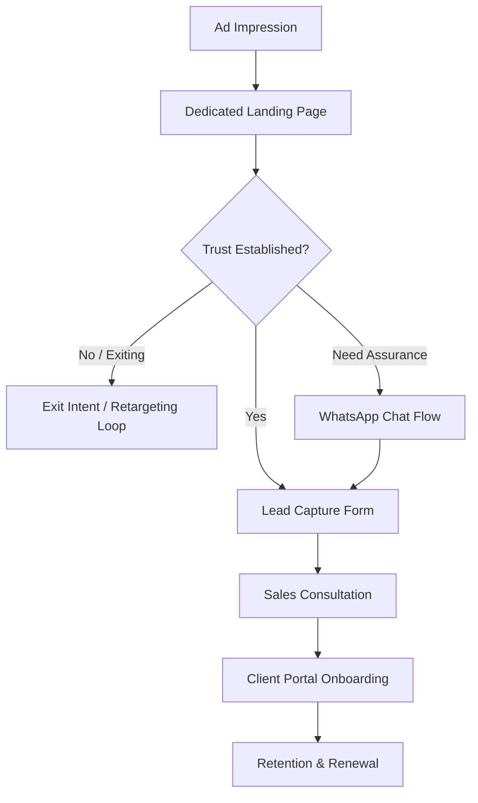

# UAE Filing — Paid User Journey

## Document Metadata & Governance

**Status:** Active – Single Source of Truth (SSOT)
**Version:** 1.0
**Owner:** Strategy & Product Team
**Last Updated:** June 2026
**Review Cycle:** Bi-Annually (Every 6 months)

## 1. Purpose & Scope

This document defines the complete structural user journey for visitors acquired through paid advertising channels. It focuses strictly on the **user flow, decision points, and psychological progression** from the first ad impression to long-term client retention.

> [!NOTE]  
> Implementation details regarding Engineering, Analytics Tracking, and Marketing Campaigns are covered in their respective departmental documentation. This document serves as a high-level Product & UX blueprint.

### Document Dependencies
* **UI/UX Implementation:** [Section Contents & UI Components](../2-Design/Section-Contents-and-UI-Components.md)
* **Organic Strategy:** [Organic User Journey](./Organic-User-Journey.md)
* **Technical Routing:** [System Sitemap & Routing](../3-Engineering/System-Sitemap-and-Routing.md)
* **System Architecture:** [Tech Stack Architecture](../3-Engineering/Tech-Stack-Architecture.md)

---

## 2. Paid Acquisition Philosophy

Paid users exhibit fundamentally different behaviors than organic users. While organic users explore deeply and build trust slowly, paid users display high intent but low patience and high skepticism. 

Because every click carries a direct financial cost, the product experience must immediately resolve objections, validate trust, and offer low-risk, frictionless conversion pathways.

---

## 3. Paid User Personas

Paid traffic is broadly divided into three core personas, each requiring distinct conversion pathways based on their mindset:

* **The High-Intent Buyer:** Ready to transact immediately. They require absolute minimal friction and instantly visible pricing.
* **The Researcher:** Comparing options. They are analytical and require strong trust signals, comparison tables, and clear FAQs.
* **The Skeptical Buyer:** Distrustful of hidden fees. They require transparent cost breakdowns and easily accessible human reassurance (e.g., WhatsApp).

---

## 4. The Paid User Journey Flow

The following diagram maps the primary progression of a paid user, illustrating critical decision points and structural recovery loops.

---

## 5. Journey Stages & Decision Points

Every stage in the paid journey is designed to fulfill specific psychological and business objectives, moving the user seamlessly to the next phase.

### 5.1. Entry & Evaluation (Dedicated Landing Page)
* **User Goal:** Quickly verify that the page offers exactly what the advertisement promised and assess if the company is trustworthy.
* **Business Goal:** Prevent immediate bounce by matching the user's intent perfectly and capturing their attention.
* **What Happens Next:** The user evaluates pricing and social proof, then decides to submit their information, seek human reassurance, or leave the site.
* **Why This Is Important:** This is the highest-friction point in the funnel. If trust and relevance are not instantly established, the acquisition cost is lost.

### 5.2. Micro-Conversion (Lead Capture)
* **User Goal:** Request expert guidance without feeling overwhelmed by complex paperwork or committing to an immediate purchase.
* **Business Goal:** Capture contact details with minimal drop-off to transition an anonymous visitor into a known lead.
* **What Happens Next:** The user completes a low-friction, step-by-step form and submits their request.
* **Why This Is Important:** It secures a micro-commitment, allowing the business to proactively assist the user rather than waiting passively for them to reach out.

### 5.3. Handoff (Sales Consultation)
* **User Goal:** Speak to a knowledgeable expert on their own schedule to resolve final doubts.
* **Business Goal:** Transition the user from a marketing lead to a sales-qualified opportunity and close the sale.
* **What Happens Next:** The user is directed to a scheduling interface to book a time, completes the consultation, and subsequently processes their payment.
* **Why This Is Important:** This is the ultimate revenue-generating conversion point where human interaction bridges the gap between digital marketing and service delivery.

### 5.4. Post-Conversion (Client Onboarding)
* **User Goal:** Feel secure that their capital was well spent and see immediate progress on their legal setup.
* **Business Goal:** Eliminate buyer's remorse and seamlessly transition the user from the Sales environment to the Product environment.
* **What Happens Next:** The user is granted access to a Client Portal featuring a clear progress dashboard tracking their application.
* **Why This Is Important:** A smooth transition prevents early churn, reduces support anxiety, and sets a strong foundation for long-term trust.

### 5.5. Long-Term (Retention & Referrals)
* **User Goal:** Renew their visa effortlessly and maintain legal compliance year over year.
* **Business Goal:** Secure recurring revenue (LTV) and generate zero-cost referral leads.
* **What Happens Next:** The user utilizes the Client Portal to execute a one-click renewal flow when their visa nears expiration.
* **Why This Is Important:** Retention and referrals are the most profitable stages of the lifecycle, maximizing the return on the initial advertising spend.

---

## 6. Journey Failure Points & Recovery Architecture

Not every user follows the ideal conversion path. Structural recovery mechanisms act as a safety net, ensuring that when users drop off due to hesitation or friction, the system actively works to re-engage them.

* **Pricing Shock Drop-Off:** Users exit the landing page when encountering the cost. 
  * *Recovery Strategy:* Capture intent before exit (e.g., offering value via a downloadable guide) to transition the user into a long-term educational nurturing flow.
* **Form Abandonment:** Users begin the lead process but fail to complete the final step. 
  * *Recovery Strategy:* Utilize assisted support channels to proactively reach out and help the user cross the finish line.
* **Consultation No-Show:** Users schedule a meeting but fail to attend. 
  * *Recovery Strategy:* Implement automated reminders and frictionless rescheduling pathways.

---

## 7. Journey Success

A successful paid user journey operates as a seamless psychological progression. At every stage, the product architecture must actively reduce user uncertainty, steadily increase trust, and naturally compel the user toward the next step without feeling forced.

### 7.1. User Success (The Emotional Outcome)
The journey is successful when the user concludes:
1. **"I am in the right place."** (Achieved via immediate message match).
2. **"I trust these experts."** (Achieved via transparent pricing and verifiable social proof).
3. **"I understand the process."** (Achieved via clear step-by-step guidance).
4. **"This was effortless."** (Achieved via frictionless forms and a seamless transition into the Client Portal).

### 7.2. Business Success (The Structural Outcome)
The journey is structurally successful when it yields:
1. **Higher Lead Quality:** Ad intent perfectly matches landing page content, filtering out unqualified traffic.
2. **Lower Abandonment Rate:** The micro-conversion UX removes cognitive load.
3. **Higher Consultation Booking Rate:** Handoff friction between marketing and sales is eliminated.
4. **Higher Conversion Rate:** Trust signals are effectively placed at the moment of highest doubt.
5. **Higher Renewal Rate:** The Client Portal proves its value, making staying easier than leaving.

---

## 8. Conclusion

The Paid User Journey is the critical bridge between advertising spend and realized revenue. By meticulously architecting every interaction—from the initial landing page evaluation to the final renewal click—UAE Filing ensures that paid traffic is converted into high-value, long-term clients through a premium, frictionless, and trust-building product experience.