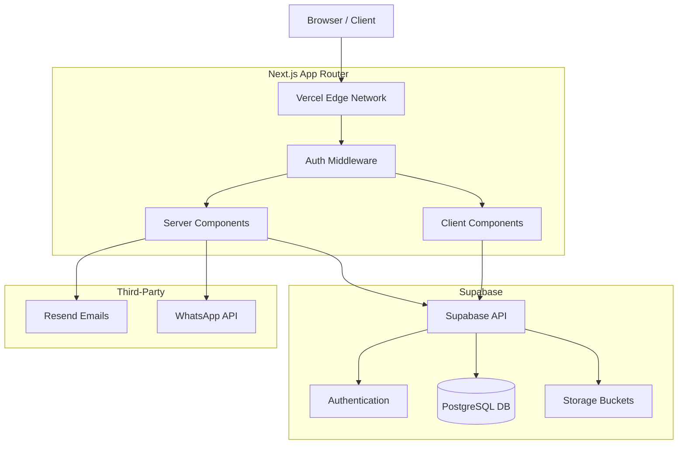

# UAE Filing — Tech Stack Architecture

## Document Metadata & Governance

**Status:** Active – Single Source of Truth (SSOT)
**Version:** 1.0.0
**Owner:** Engineering Lead
**Last Updated:** June 2026
**Review Cycle:** Quarterly

## Purpose

This document defines the complete technology architecture for UAE Filing.

It serves as the single source of truth for:
* Frontend development framework
* Backend infrastructure
* Communication systems
* Analytics
* Hosting

The goal is to ensure every technical decision supports the business objective:
> Help freelancers become legally established in the UAE through a premium, trustworthy, and modern digital experience.

---

## High-Level Architecture Diagram



---

## Architecture Principles

To maintain a scalable and manageable codebase, development must adhere to the following engineering philosophy:

* **Server Components by Default:** Next.js Server Components should be the default for fetching data and rendering non-interactive UI to reduce client bundle size.
* **Client Components Sparingly:** Use the `"use client"` directive only when browser APIs, React state/hooks, or interactive event listeners are required.
* **Centralized Business Logic:** Shared utility functions, API calls, and business rules belong inside the `lib/` directory.
* **Reusable UI:** Shared UI elements (buttons, inputs, cards) must be abstracted into reusable components to maintain visual consistency.
* **Centralized Validation:** Form validation and data schema validation (e.g., using Zod) should be centralized and shared between the client and server.
* **Composition Over Inheritance:** Build flexible components that accept `children` rather than creating complex, heavily prop-drilled monolithic components.
* **DRY (Don't Repeat Yourself):** Avoid duplicated business logic. 
* **Separation of Concerns:** Keep marketing pages, client portal logic, and administrative tools strictly separated within the routing structure.

---

## Why This Stack Was Chosen

The chosen stack must satisfy six requirements:
1. Premium user experience
2. Fast loading speeds
3. Strong SEO performance
4. Lead generation capability
5. Future client portal support
6. Long-term scalability

Many competitors use WordPress or low-code builders. UAE Filing uses a modern application architecture that supports both marketing and operations without requiring a major platform migration in the future.

### Technology Decision Matrix

| Domain | Selected Technology | Primary Reason | Alternatives Rejected |
| :--- | :--- | :--- | :--- |
| **Framework** | Next.js 15 (App Router) | Best-in-class SEO, Server Components, unified full-stack capability | React SPA (poor SEO), WordPress (poor DX, low scale) |
| **Language** | TypeScript | Type safety, maintainability, fewer runtime errors | JavaScript |
| **Styling** | Tailwind CSS | Rapid utility-class UI development, highly maintainable design system | Vanilla CSS, Styled Components |
| **Backend/DB** | Supabase (PostgreSQL) | Instant APIs, integrated Auth/Storage, Postgres power without DevOps overhead | Firebase (NoSQL limitations), Custom Express API |
| **Hosting** | Vercel | Seamless Next.js deployment, Edge caching | AWS EC2, DigitalOcean |
| **Animations** | Framer Motion & Lenis | Premium, luxury interaction design and scroll physics | CSS Transitions only (too rigid) |

---

## Rendering Strategy

The application leverages Next.js rendering capabilities to optimize delivery:

* **Static Generation:** Marketing pages (`/`, `/services`, `/pricing`) should be statically generated at build time for maximum speed and SEO performance.
* **Server Components:** Data-driven pages (e.g., Client Portal dashboards) should utilize Server Components for secure, server-side data fetching.
* **Client Components:** Interactive elements (forms, animated heroes, mobile navigation) rely on Client Components for seamless interactivity.
* **Dynamic Rendering:** When rendering relies on request-time information (e.g., authentication cookies in the Admin Dashboard), dynamic rendering is required.

---

## State Management Strategy

Application state should be managed thoughtfully to avoid unnecessary complexity:

* **Local Component State:** Use React `useState` and `useReducer` for isolated, temporary UI states (e.g., toggling a dropdown or accordion).
* **Global UI State:** For global UI interactions (e.g., opening a modal across different components), use React Context. Do not introduce heavy libraries like Redux unless strictly necessary.
* **Server State:** Data fetched from the database should be handled via Server Components or lightweight fetching libraries (e.g., SWR or React Query) on the client, minimizing the need for complex global state stores.
* **Form State & Validation:** Use dedicated libraries (e.g., React Hook Form combined with Zod) to manage form states, inputs, and validation errors efficiently.

---

## Request Lifecycle

The high-level flow of a request through the UAE Filing architecture operates conceptually as follows:

```text
Browser (User Request)
   ↓
Vercel Edge Network (Next.js)
   ↓
Middleware (Authentication & Route Protection)
   ↓
Server Components (Data Fetching / Rendering)
   ↓
Supabase API (Data Access layer)
   ↓
PostgreSQL Database (Storage)
   ↓
Response (HTML/JSON)
   ↓
Browser (UI Rendered)
```

---

## Security Principles

Security is paramount, especially when handling sensitive client documents (passports, visas). 

* **Authentication:** Managed via Supabase Auth (Email and OAuth).
* **Route Protection:** Next.js Middleware intercepts requests to secure the Portal and Admin zones.
* **Row Level Security (RLS):** Enforced at the database level so users can only access their own records, regardless of frontend vulnerabilities.
* **Signed URLs:** Private storage buckets require temporary signed URLs for file access; files are never publicly exposed.
* **Environment Secrets:** Strict separation of public (browser-safe) and private (server-only) environment variables.
* **Server-Side Validation:** All user input must be validated on the server, even if client-side validation passes.
* **Principle of Least Privilege:** Service roles and admin privileges must be granted strictly and securely.

---

## Performance Strategy

To ensure a premium, instant feel, performance optimization is a continuous priority:

* **Image Optimization:** All images must be served via the Next.js `<Image />` component for automatic WebP conversion, resizing, and layout shifting prevention.
* **Font Optimization:** Use `next/font` to automatically host fonts at the edge, preventing layout shifts (CLS).
* **Code Splitting & Lazy Loading:** Automatically handled by Next.js. Heavy client components or libraries should be dynamically imported where appropriate.
* **Metadata Optimization:** Ensure all marketing routes dynamically generate SEO metadata for search engines.
* **Edge Caching:** Leverage Vercel's Edge Network to cache static marketing assets globally.

---

## Frontend Layer

### Next.js 15 (App Router)
* **Purpose:** Primary application framework.
* **Used For:** Website, Client Portal, Admin Dashboard.
* **Benefits:** Excellent SEO, fast page loads, server-side rendering, production stability, scalable architecture.
* **Alternatives Considered:** React SPA Only (Rejected because of more setup required, worse SEO by default, more backend complexity).

### TypeScript
* **Purpose:** Application type safety.
* **Used For:** Entire project codebase.
* **Benefits:** Fewer bugs, better maintainability, safer refactoring, professional code standards.

### Tailwind CSS
* **Purpose:** UI styling framework.
* **Used For:** Layout, Components, Responsive design, Theme architecture.
* **Benefits:** Rapid development, consistent design system, easy theme management.

### Motion Layer
*(For specific animation timings and UI motion rules, see [Design Tokens & Theme Architecture](../2-Design/Design-Tokens-and-Theme-Architecture.md)).*
* **Framer Motion:** Animation engine for hero reveals, floating elements, FAQ transitions, and pricing switcher animations.
* **Lenis:** Smooth scrolling engine to create a fluid, luxury scrolling experience mimicking high-end product websites.

### Icon System
* **Lucide Icons:** Lightweight, modern, clean visual language for services, trust indicators, and dashboard navigation.

---

## Backend Layer

### Supabase
* **Purpose:** Primary backend platform (Database, Auth, Storage, Edge Functions).
* **Business Benefit:** Faster development and lower operational complexity without maintaining separate infrastructure.

*(For detailed tables, schema, RLS, and storage setup, see the [Database Schema](./Database-Schema.md)).*

### Authentication
* **Supabase Auth:** Secure account management.
* **Google OAuth:** One-click login to reduce friction for the Client Portal.

---

## Communication Layer

### WhatsApp Business API
* **Purpose:** Primary client communication channel. WhatsApp is the preferred communication platform in the UAE.
* **Used For:** Status updates, notifications, visitor support.

### Email (Resend)
* **Purpose:** Transactional email service.
* **Benefits:** Modern developer experience, high deliverability, simple integration.
* **Used For:** Welcome emails, consultation confirmations, document notifications, renewal reminders.

---

## Analytics Layer

### Google Analytics 4
* **Purpose:** Business analytics (Traffic data, conversion tracking, user acquisition insights).

### Microsoft Clarity
* **Purpose:** Behavior analytics (Heatmaps, session recordings, click tracking, scroll tracking).

---

## Hosting Layer

### Vercel
* **Purpose:** Deployment platform.
* **Benefits:** Built for Next.js, fast deployment, global CDN, excellent performance.

---

## Future Technical Roadmap

This architecture inherently supports the following strategic rollouts:

1. **Phase 1: Marketing Website:** Static generation, lead capture, and organic/paid landing pages.
2. **Phase 2: Client Portal:** Authentication, secure document upload, and application status tracking.
3. **Phase 3: Admin Dashboard:** Centralized operations, client management, and document verification.
4. **Phase 4: Payments:** Stripe integration for direct online package purchasing.
5. **Phase 5: Automation:** Automated WhatsApp updates and Email workflows (e.g., Renewal reminders).
6. **Phase 6: CRM Expansion:** Advanced internal notes, communication logs, and sales tracking.
7. **Phase 7: AI Features:** Potentially integrating LLMs for automated initial consultation filtering or document parsing.

---

## Out of Scope

The following technologies and patterns are explicitly excluded from the current architecture:
* **Custom Backend Infrastructure:** Maintaining separate Node.js/Express servers or containerized microservices (handled by Supabase).
* **Native Mobile Apps:** No iOS or Android native development (handled by responsive web design).
* **Heavy Global State Managers:** Redux, MobX, etc., are unnecessary given Next.js server components and lightweight local state.
* **NoSQL Databases:** e.g., MongoDB, Firebase Firestore (PostgreSQL relational data is required).

---

## Related Documents
* [Developer README](./Developer-README.md)
* [System Sitemap & Routing](./System-Sitemap-and-Routing.md)
* [Database Schema](./Database-Schema.md)
* [Design Tokens & Theme Architecture](../2-Design/Design-Tokens-and-Theme-Architecture.md)